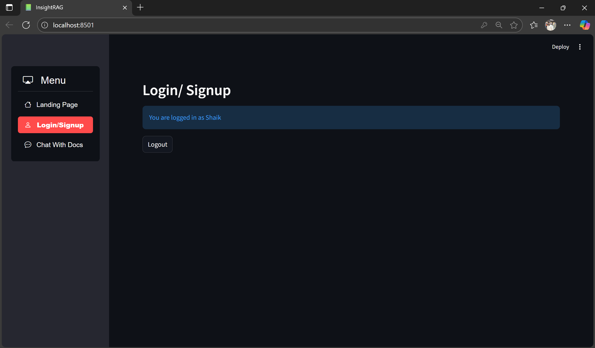

# RAG Document Search System

## Overview
This project is a **Retrieval-Augmented Generation (RAG) based Document Search Application**.  
It allows users to upload documents, transform them into vector embeddings, and perform semantic search with natural language queries. The system retrieves the most relevant parts of documents and combines them with a language model to generate accurate and context-aware answers.

The application is implemented as a **Streamlit web app** with FAISS for efficient vector search and SQLite (`users.db`) for user management.

---

## Features
- **User Authentication** – Stores user information in `users.db`.
- **Document Upload** – Supports uploading of PDFs and text files.
- **Embedding & Storage** – Documents are converted into embeddings and indexed in FAISS.
- **Semantic Search** – Queries are compared against embeddings for precise retrieval.
- **LLM-powered Responses** – Uses retrieved content to generate natural language answers.
- **Interactive Web Interface** – Built with Streamlit for easy interaction.

---

## Role of `ingest.py`
The `ingest.py` file is responsible for **preprocessing and storing documents**.  
- It splits documents into smaller chunks.  
- Generates embeddings for each chunk using a transformer model.  
- Saves these embeddings into a **FAISS vector index** inside the `data/faiss_index/` folder.  

This step ensures that later queries can quickly retrieve relevant chunks without reprocessing documents each time.


## Project Structure
```
InsightRAG/
│── app.py # Main Streamlit application
│── ingest.py # Script for preprocessing and indexing documents
│── users.db # SQLite database for storing user information
│── requirements.txt # Python dependencies
│── .env # Environment variables (API keys, configs)
│── data/
│ └── faiss_index/ # FAISS vector database files
│── user_uploaded_files/ # Example uploaded PDFs
│── image.webp # App logo/banner
│── README.md # Project documentation

```

## 🖼️ Project Preview

HomePage<br>
 <br>
SignUpPage



## How to Run

1. **Install dependencies**
   ```bash
   pip install -r requirements.txt
2. Set environment variables
Add your API keys to the .env file (e.g., HuggingFace/OpenAI for embeddings and LLM)
3.Ingest Documents
```
python ingest.py
```
This will process documents and store them into FAISS index.

4. Run the application
```
streamlit run app.py
```


